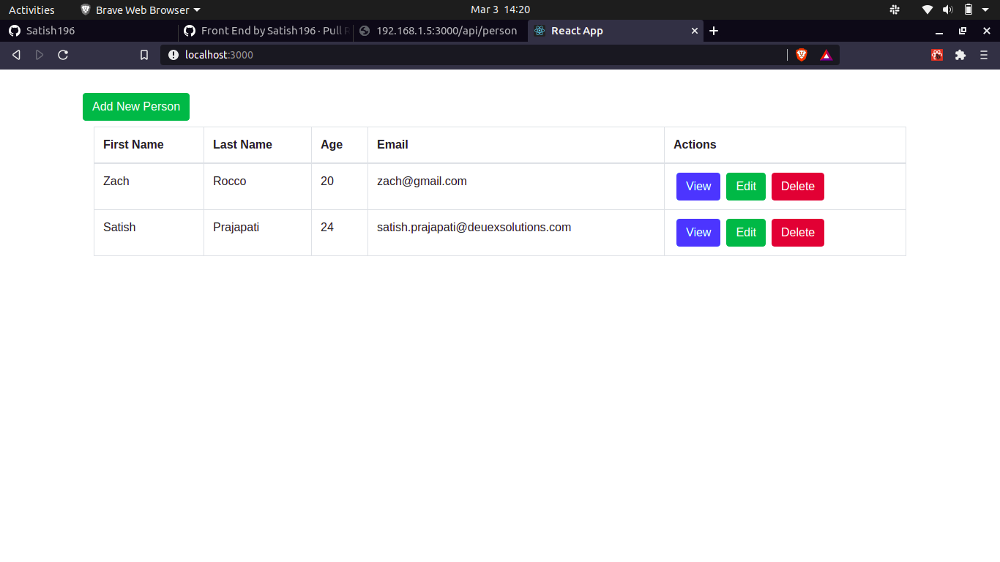
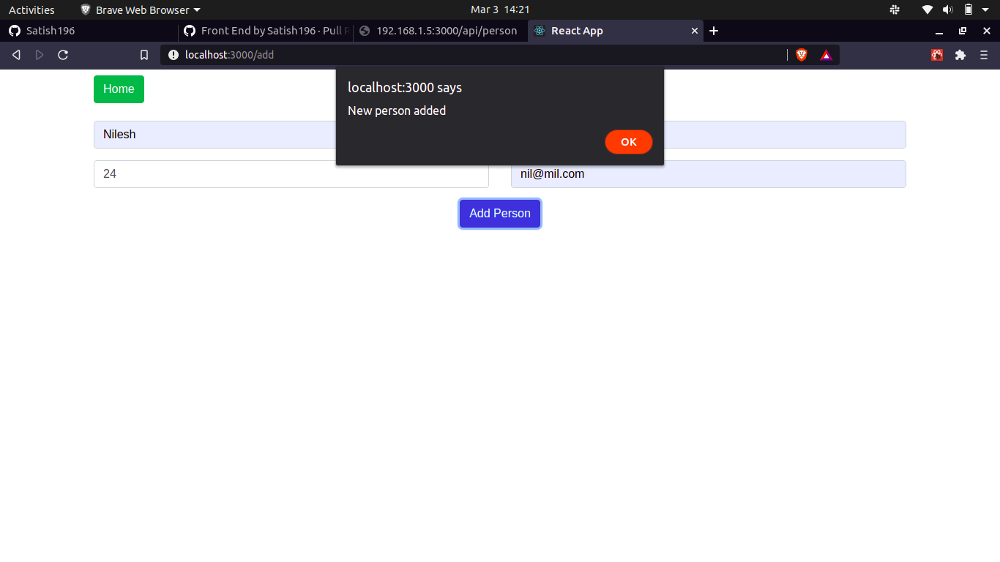
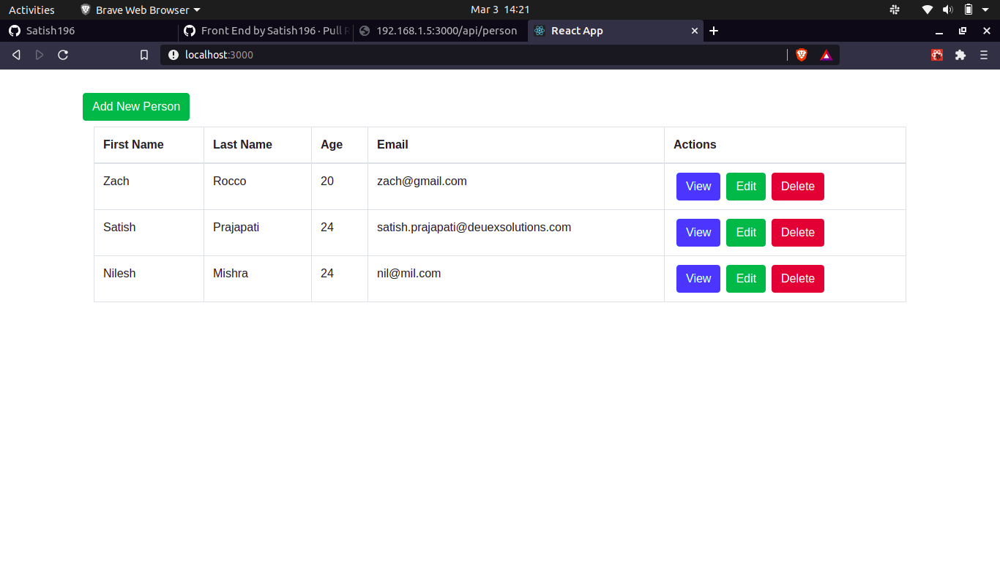
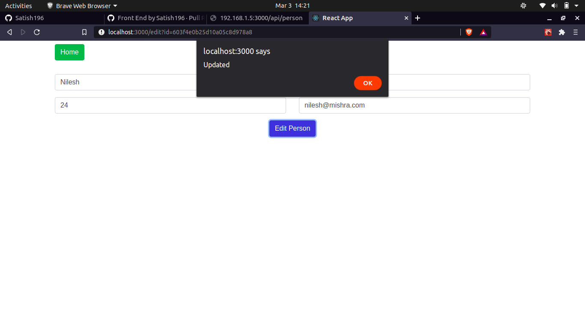
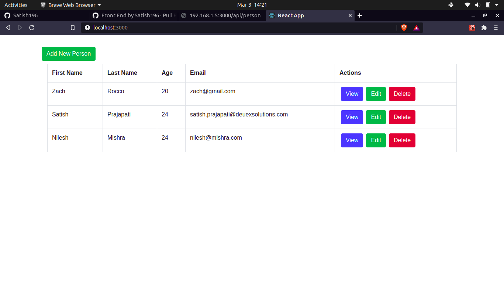
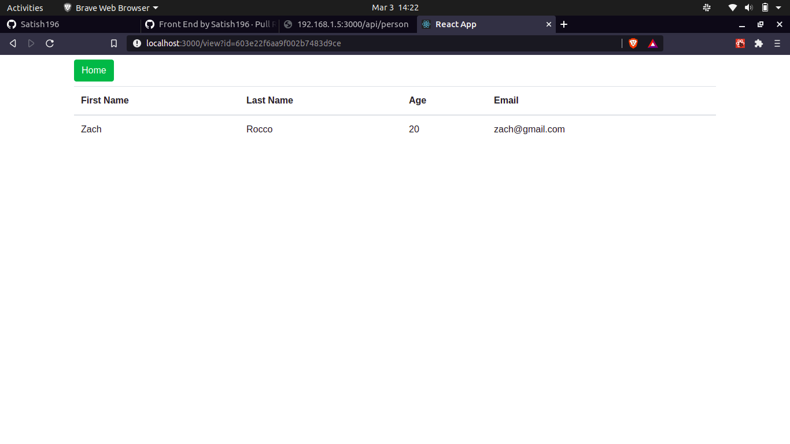

# MERN CRUD APP

A simple CRUD application created with Node.js, Express.js, Mongoose.js ORM, MongoDB, React.js

## Prerequisite
Make sure you have MongoDB Up & Running before running the application.

### Running application

```sh
$ git clone https://github.com/Satish196/MERN-Crud.git
$ cd MERN-Crud
```

Installing Node.js Packages

```sh
$ npm install
```

Installing React.js Packages

```sh
$ cd client
$ npm install
```

Starting Node.js & React.js Server

```sh
$ cd ..
$ npm run dev
```

Front-End
Open [http://localhost:3000](http://localhost:3000) to view it in the browser.

Back-End
Open [http://localhost:4000/api/person](http://localhost:3000/api/person) to view it in the browser.


### Few screenshots

Home Page


Add Person


After Adding Person


Edit Person


After Edit Person


View Single Person


After Delete
